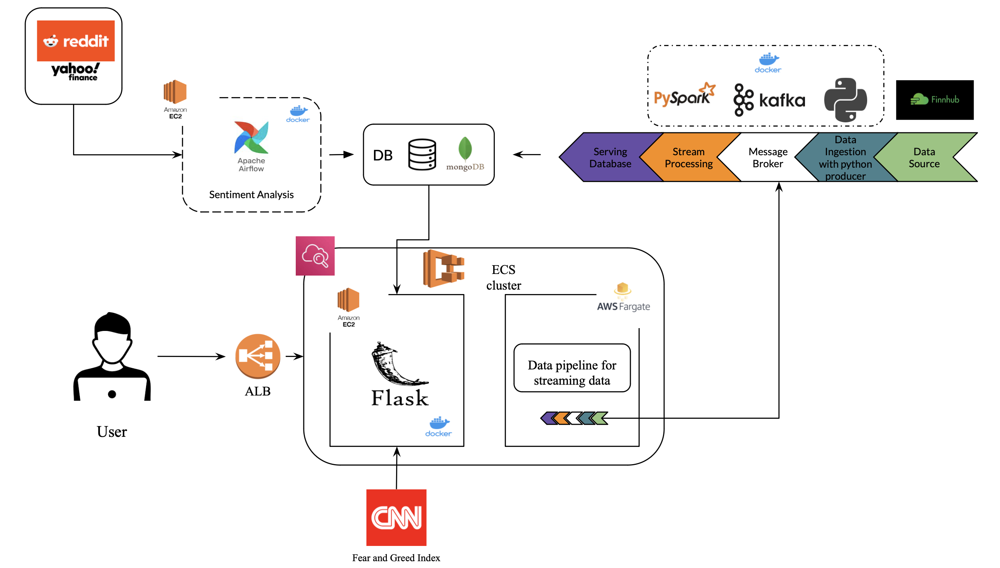

# TradeChat

Trade Chat provides a platform for users to discuss companies of interest and receive real-time feedback on market sentiment analysis for these companies. Additionally, it offers basic backtesting and forecasting tools to users, creating a comprehensive stock trading community platform.

## Table of contents
- [TradeChat](#tradechat)
  - [Table of contents](#table-of-contents)
  - [Feature](#feature)
  - [System Architecture](#system-architecture)
  - [Technical Detail](#technical-detail)
  - [Demo](#demo)
  - [Deployment](#deployment)
  - [Technologies Used](#technologies-used)

## Feature
- Real-time market price of seven big tech companies from FinnhubAPI.
- Historical Twitter sentiment analysis of the seven big tech companies.
- Market sentiment analysis with Reddit posts and comments using PRAW.
- Backtesting system.
- Join a community of traders to discuss companies of interest.

## System Architecture

## Technical Detail

## Demo

## Deployment

## Technologies Used
```