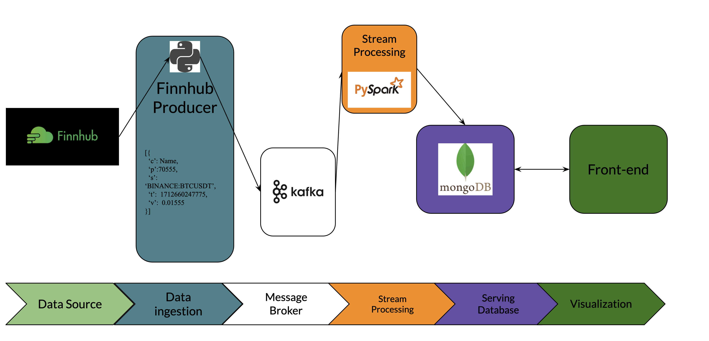

# TradeChat

Trade Chat provides a platform for users to discuss companies of interest and receive real-time feedback on market sentiment analysis for these companies. Additionally, it offers basic backtesting and forecasting tools to users, creating a comprehensive stock trading community platform.

Website: [TradeChat](https://tradechat.online/)

## Table of contents
- [TradeChat](#tradechat)
  - [Table of contents](#table-of-contents)
  - [Feature](#feature)
  - [System Architecture](#system-architecture)
  - [Data Pipeline](#data-pipeline)
    - [Real-time market price](#real-time-market-price)
  - [Demo](#demo)
  - [Deployment](#deployment)
  - [Technologies Used](#technologies-used)

## Feature
- Real-time market price of seven big tech companies from FinnhubAPI.
- Historical Twitter sentiment analysis of the seven big tech companies.
- Market sentiment analysis with Reddit posts and comments using PRAW.
- Backtesting system.
- Join a community of traders to discuss companies of interest.

## System Architecture


- Front-end: 
  - HTML, CSS and Javascript are used to create the front-end of the application.
  - Plotly is used to create interactive plots for the Fear & Greed Index and sentiment analysis.


- Back-end:
  - A Flask-based webserver is used to serve the front-end and handle API requests.
  - Kafka is used to stream real-time market data from FinnhubAPI, pyspark is used to process the data and store in MongoDB.
  - Reddit posts and comments are fetched using PRAW, and sentiment analysis is done using vaderSentiment(https://pypi.org/project/vaderSentiment/). Airflow is used to schedule the sentiment analysis job.

A brief description of the system architecture:

Containerization: Docker is used to containerize all the application. This allows for easy deployment and scaling of the application.

Streaming Data: The application uses Kafka to stream real-time market data from FinnhubAPI, pyspark is then used to process the data and store in MongoDB.

Sentiment analysis: The application uses PRAW to fetch Reddit posts and comments, and vaderSentiment(https://pypi.org/project/vaderSentiment/) to analyze the sentiment of the posts and comments.


## Data Pipeline
 ### Real-time market price
 
## Demo


## Deployment

## Technologies Used
```

```